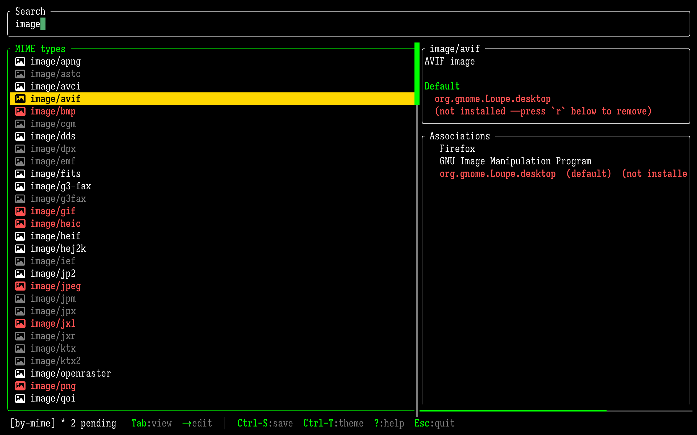
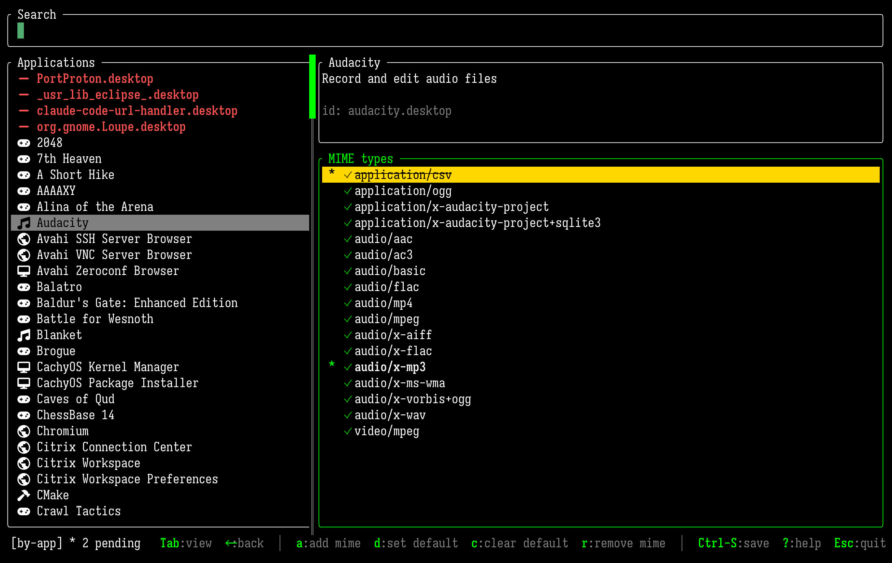
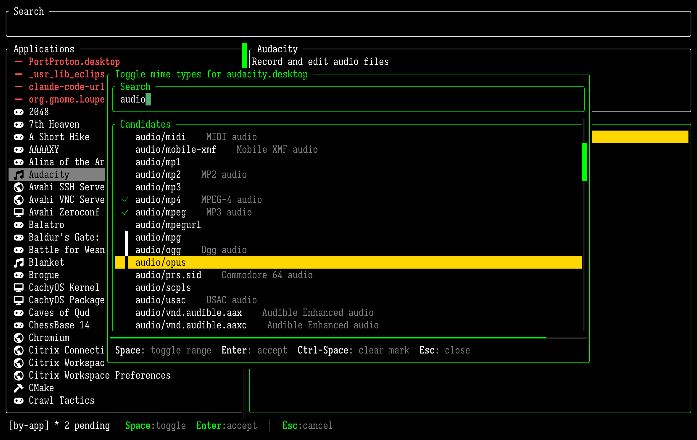
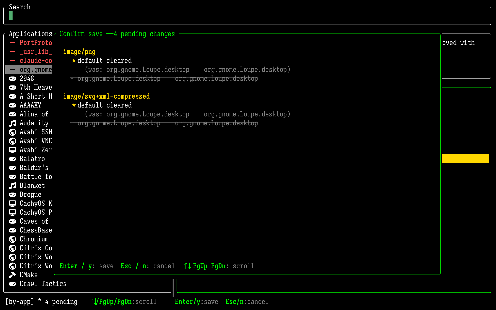

# mime-tui

A keyboard-driven terminal UI for managing the MIME-type->application
associations that file managers and `xdg-open` consult on linux. 

If you use a window manager on linux and not a full blown desktop environment like KDE, Gnome or XFCE - you still want to manage MIME type associations.

Even though I mainly use terminals, I often lazily execute "open somefile.thngy" in a terminal, or attempt to open something in yazi - and sometimes then discover that the file opens in some crazy application I would never choose, or that nothing happens at all as there is no association. Then I want to quite quickly add an association, then realise that this involves finding some desktop envirvonment GUI like XFCE's mime type manager. This is horrible for a proper hard-bitten Sway user who lives in terminals.

So, with the recent resurgance in TUI interfaces I thought it would be very nice to have a fast and efficient TUI for managing mime type associations in a keyboard-centric way.

As you probably don't intend to use a mime editor every day, it is focussed on being easy to use and well prompted with keyboard help. You should be able to launch it to edit something once or twice every 6 months - and be able to use it easily.

mime-tui only updates `~/.config/mimeapps.list` - so it may not interact well with Gnome and KDE where they have "override" files where they preferentially look for mime associations over and above the mimeapps.list. mime-tui is probably best suited for users of Sway, Hyprland, and so on as a result.

mime-tui also will surface all your broken file associations. If you are anything like me you may have a long history of chaos on your desktop, things being added and removed over the years and different desktop envs tried out. This can lead to a lot of file associations to no-longer installed applications! mime-tui will make this obvious and allow for easy and quick fixing.

Some screenshots:

  <p align="center"><br/>
  <sub>Browsing MIME types. Red are associated with uninstalled applications, grey are not associated with anything.</sub></p>
  <p align="center"><br/>
  <sub>Editing Audacity associations - with some pending removal, and some pending being added - which will happen when Ctrl-S is pressed</sub></p>
  <p align="center"><br/>
  <sub>Adding multiple file associations to Audacity</sub></p>
  <p align="center"><br/>
  <sub>Confirmation dialogue before finally approving</sub></p>

## Features

- **Two browse modes.** Bang `Tab` to switch between "by app" (which apps handle
  this?) and "by mime" (which mimes does this app handle?).
- **Live fuzzy search.** There's 800 mime types on my system and quite a few apps.
- **Inline edits with live preview.** Edits accumulate in memory and the UI
  reflects them immediately - highlighting added and removed items - then hitting `Ctrl-S` takes you to a final review screen for you to check before writing out.
- **Atomic save.** I'm a bit paranoid about my code destroying people's file associations and mildly irritating them. So mime-tui writes a tempfile then renames, and has a rolling `.bak` file.
  After a successful save, runs `update-desktop-database` best-effort so
  other apps see your edit without a logout/login. And, before save we check if anything else has modified associations (maybe mime-tui was left open for 5 days in a terminal window and applications were added and removed? Got to be paranoid) - and if they have we merge the changes in, and if there's a conflict mime-tui refuses to action it.
- **XDG-correct read.** Walks the full priority chain - per-desktop
  overrides (`gnome-mimeapps.list`, etc.), `$XDG_CONFIG_DIRS`, and the
  deprecated locations under `$XDG_DATA_DIRS` - and resolves them per
  spec.
- **Override-aware.** When a default came from a higher-priority file,
  the detail pane shows where it lives, and a save that would be silently
  shadowed prints a warning so you know to edit the override file by
  hand.
- **Saves only `$XDG_CONFIG_HOME/mimeapps.list`.** Never touches system
  files or per-desktop overrides without you explicitly editing them.
- **Fast startup.** `.desktop` files are parsed once and cached in
  SQLite; subsequent runs do mtime-only checks and start in milliseconds.
- **Themable.** Colors, borders, cursor shape, etc. via an optional
  TOML config. Every field falls back to a built-in default.
- **Mouse supported.** Click to select, scroll-wheel to navigate - I think almost the whole UI is mouseable, despite being a terminal app.

## Install

On arch/cachyOS - install **mime-tui** from the AUR.

You probably want to install a nerd font like `ttf-firacode-nerd` - for icons, line drawing characters etc.

Manually - you should install rust toolchain first (get rustup) then:

```bash
git clone https://github.com/yourname/mime-tui
cd mime-tui
cargo build --release
sudo cp target/release/mime-tui /usr/local/bin/
```

Then run it:

```bash
mime-tui
```

## Configuration

There really isn't much config except related to theming where I tried to make it a bit flexible, I know terminal and TUI users have all kinds of wacky colour schemes so mime-tui tries to be flexible.

`mime-tui` looks for `~/.config/mime-tui/mime-tui.toml`. Every field is
optional. The simplest config picks a preset:

```toml
preset = "gruvbox-dark"
```

### Shipped presets

| Preset             | Notes                                                       |
| ------------------ | ----------------------------------------------------------- |
| `default-dark`     | The built-in defaults — white borders, green focus, gold ★. |
| `default-light`    | For light-background terminals — dark borders, amber ★.     |
| `gruvbox-dark`     | Warm earthy palette; ★ in bright orange.                    |
| `solarized-light`  | Cream background, muted blue accents.                       |
| `dracula`          | Signature purple focus + vivid markers.                     |
| `nord`             | Cool frost / aurora palette.                                |
| `monokai`          | Vivid neon — ★ in pink.                                     |

### Overrides

Individual `[theme]` fields override the preset:

```toml
preset = "dracula"

[theme]
focus = "#ff0000"           # override just one knob; rest stays dracula
```

### Full theme reference

```toml
search_position = "top"     # or "bottom"
timeout = 0                 # auto-exit after N idle seconds; 0 disables
preset = "default-dark"     # see table above

[theme]
border        = "#ffffff"
focus         = "#00ff00"   # focused border + heading colour
unfocused     = "#808080"   # selection-bar background of an UNfocused list
highlight     = "#ffd700"   # selection-bar background of a focused list
secondary     = "#808080"   # de-emphasised text (e.g. ".desktop" ids in picker)
selection_fg  = "#000000"   # foreground drawn on top of the selection bar
border_style  = "rounded"   # plain | rounded | thick | double
cursor_shape  = "block"     # block | underline | pipe

# Scrollbar — both fall back to focus/unfocused respectively when blank.
scrollbar_thumb = ""
scrollbar_track = ""

# Relation markers in the picker and by-app right pane. Empty fields
# fall back: marker_default→highlight, marker_associated→focus,
# marker_declared_only→secondary. Override for stronger contrast on the
# selection bar, or just to match your terminal palette.
marker_default       = ""   # the ★ glyph
marker_associated    = ""   # the ✓ glyph
marker_declared_only = ""   # the · glyph
```

### Colour syntax

Each colour field accepts:

- **Hex**: `"#ff8800"` / `"#f80"` / `"#ff8800aa"` (alpha ignored).
- **ANSI named**: `"red"`, `"green"`, `"yellow"`, `"blue"`, `"magenta"`,
  `"cyan"`, `"white"`, `"black"`, `"gray"`, plus `"bright_*"` /
  `"light_*"` / `"dark_gray"` variants. The terminal emulator picks the
  actual RGB — convenient for matching your terminal palette.
- **`"reset"`** / **`"default"`** / **`""`**: the terminal's default
  foreground or background. Useful for keeping `mime-tui` visually quiet
  in your shell.

Mix freely: `border = "reset"`, `focus = "bright_green"`,
`highlight = "#ffaa00"` is a valid combination.

## Files written

- `$XDG_CONFIG_HOME/mimeapps.list` - this is the only file ever written, plus a
  rolling `.bak` alongside.
- `$XDG_DATA_HOME/mime-tui/mime-tui.sqlite` - a parse cache for installed
  `.desktop` files and shared-mime-info descriptions. Purely a speed
  optimisation and safe to delete at any time.
