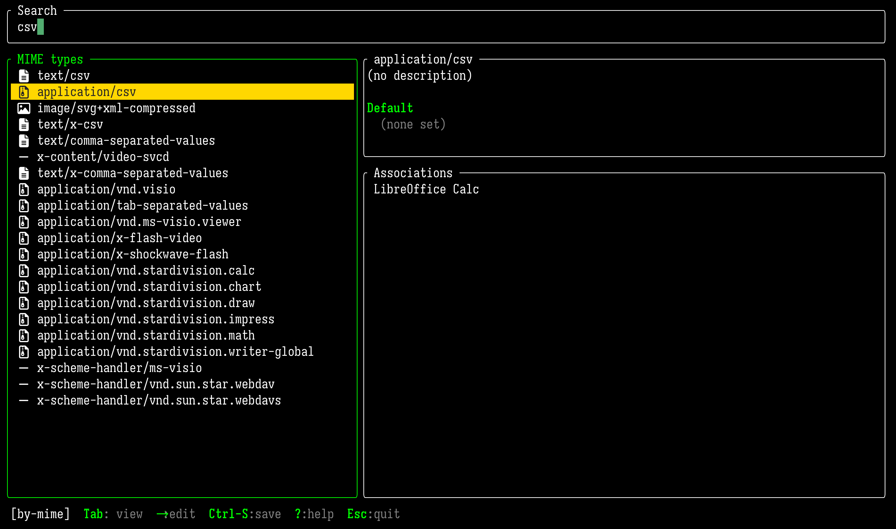
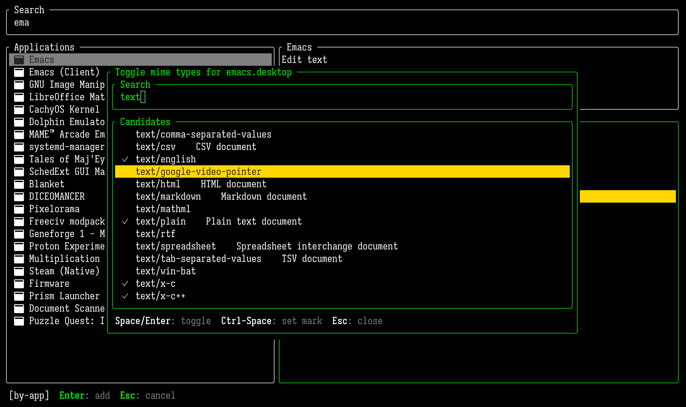

# mime-tui

A keyboard-driven terminal UI for managing the MIME-type → application
associations that file managers and `xdg-open` consult on Linux. The same
defaults you would otherwise edit through GNOME Settings, KDE System
Settings, or by hand in `~/.config/mimeapps.list` — only this one loads
fast, runs in any terminal, and behaves identically on every desktop.

<p align="center">
  
  
</p>

<p align="center">
  <sub><b>Left:</b> browsing MIME types, filtered to <code>csv</code> — the right pane shows the resolved default and full associations list for the selected type. &nbsp;
  <b>Right:</b> the by-app view with the multi-toggle picker open over it, set up to associate several <code>text/*</code> types with Emacs in one keystroke.</sub>
</p>

## Features

- **Two browse modes.** `Tab` between "by MIME type" (which apps handle
  this?) and "by application" (which mimes does this app handle?).
- **Live fuzzy search.** Type to filter the left list — prefix matches
  rank above fuzzy hits.
- **Inline edits with live preview.** `d` set default, `r` remove, `c`
  clear default, `a` open picker. Edits accumulate in memory and the UI
  reflects them immediately; an explicit `Ctrl-S` writes them out.
- **Multi-toggle picker.** `Space` / `Enter` flips the highlighted row on
  or off and stays open so you can rapidly toggle many entries. Each row
  shows its current relationship (`★` default, `✓` associated, `·`
  declared-only, blank if unrelated). `Ctrl-Space` sets an emacs-style
  mark for range operations; the whole marked range then toggles
  uniformly.
- **Atomic save.** Writes a tempfile then renames, with a rolling `.bak`.
  After a successful save, runs `update-desktop-database` best-effort so
  other apps see your edit without a logout/login.
- **XDG-correct read.** Walks the full priority chain — per-desktop
  overrides (`gnome-mimeapps.list`, etc.), `$XDG_CONFIG_DIRS`, and the
  deprecated locations under `$XDG_DATA_DIRS` — and resolves them per
  spec.
- **Override-aware.** When a default came from a higher-priority file,
  the detail pane shows where it lives, and a save that would be silently
  shadowed prints a warning so you know to edit the override file by
  hand.
- **Saves only `$XDG_CONFIG_HOME/mimeapps.list`.** Never touches system
  files or per-desktop overrides without you explicitly editing them.
- **Fast startup.** `.desktop` files are parsed once and cached in
  SQLite; subsequent runs do mtime-only checks and start in milliseconds.
- **Themable.** Colors, borders, cursor shape, etc. via an optional
  TOML config — every field falls back to a built-in default.
- **Mouse supported.** Click to select, scroll-wheel to navigate.

## Install

```bash
git clone https://github.com/yourname/mime-tui
cd mime-tui
cargo build --release
sudo cp target/release/mime-tui /usr/local/bin/
```

Then run it:

```bash
mime-tui
```

## Keybindings

Press **`?`** at any time for the full reference. The most useful ones:

| Key                          | What it does                                              |
| ---------------------------- | --------------------------------------------------------- |
| `Tab`                        | switch between by-mime / by-app views                     |
| arrows, `PgUp` / `PgDn`      | navigate (emacs `C-n` / `C-p` / `C-v` / `M-v` also work)  |
| typing                       | fuzzy-filter the left list                                |
| `→`                          | move focus to the right pane (enter edit mode)            |
| `d` / `r` / `c`              | *(right pane)* set default / remove / clear default       |
| `a`                          | *(right pane)* open picker to add associations            |
| `Space` / `Enter`            | *(in picker)* toggle the row at the cursor                |
| `Ctrl-Space`                 | *(in picker)* set / clear mark for range selection        |
| `Ctrl-S`                     | save pending edits                                        |
| `Ctrl-Z`                     | discard all pending edits                                 |
| `Esc`                        | quit (confirms if unsaved); also dismisses overlays       |
| `?`                          | show keybindings overlay                                  |

## Configuration

`mime-tui` looks for `~/.config/mime-tui/mime-tui.toml`. Every field is
optional — anything you don't set keeps its default.

```toml
search_position = "top"     # or "bottom"
timeout = 0                 # auto-exit after N idle seconds; 0 disables

[theme]
border        = "#ffffff"
focus         = "#00ff00"   # focused border + heading colour
unfocused     = "#808080"
highlight     = "#ffd700"   # selection-bar background
border_style  = "rounded"   # plain | rounded | thick | double
cursor_shape  = "block"     # block | underline | pipe
```

## Files written

- `$XDG_CONFIG_HOME/mimeapps.list` — the only file ever written, plus a
  rolling `.bak` alongside.
- `$XDG_DATA_HOME/mime-tui/mime-tui.sqlite` — a parse cache for installed
  `.desktop` files and shared-mime-info descriptions. Purely a speed
  optimisation; safe to delete at any time.
